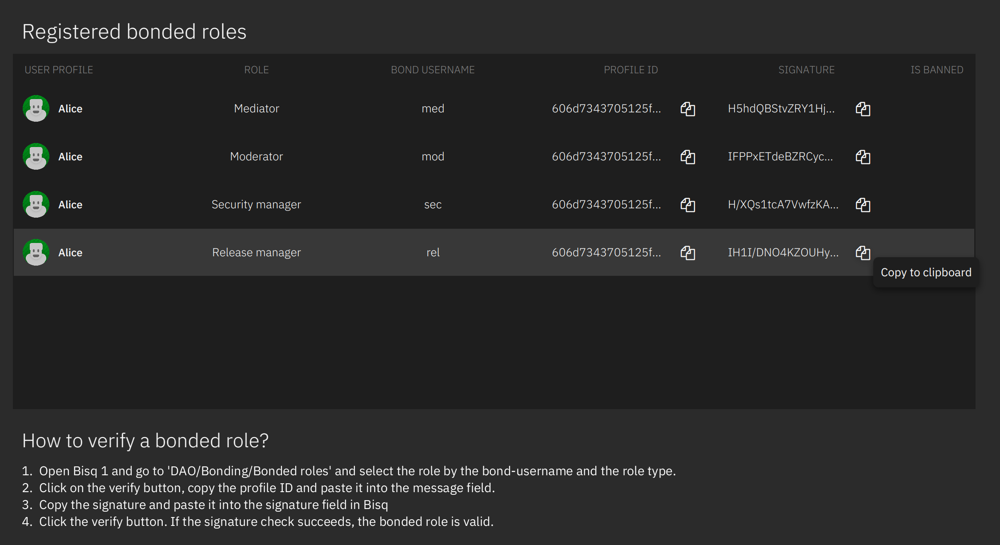

# Bonded roles

All important roles and network nodes require a BSQ bond to secure the roles.
For Seed nodes and oracle nodes we require at least 1 node which is available by default as otherwise it would be a
chicken-and-egg problem.
The oracle node manages the registration and verification of the other nodes.

## Developer setup (localhost, regtest)

To register different roles and nodes it requires to run those nodes in that order:

- Bitcoind (regtest for testing)
- Bisq 1 seednode
- Bisq 1 desktop app
- Bisq-daonode
- Bisq 2 seed node
- Bisq 2 Oracle node
- Bisq 2 desktop app

Please read the descriptions in the oracle node document for more details about the setup of the oracle node and
daonode.

1. Make a dao proposal for the bonded role you want to register (including a GitHub issue)
2. After accepted by DAO voting follow the instructions in Bisq 2 how to register the role or node.
3. Once a role is successfully registered the left navigation shows an additional `Authorized role` menu item. At that
   screen there are tabs for each registered role in case the selected user profile has multiple roles. Nodes do not
   appear in that screen as there is nothing to manage.
4. Use the management screens for exploring the role's use cases.

> _Note: It is recommended for role owners to run a development node to try
out the features and fully understand what the role can do and how it interacts with users._

Registered roles are listed with the relevant details for verification.

