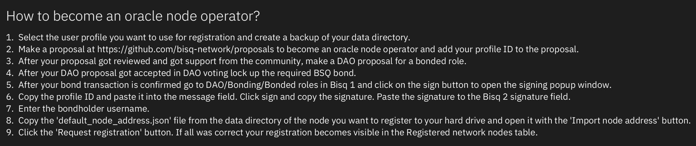

# How to operate a Bisq 2 oracle node

## Requirements:

- Install the oracle node on a VPS with min. 8 GB RAM, min 4 vCPUs and about 700 GB storage for the un-pruned, indexed
  Bitcoin blockchain.
- An oracle node operator need to make a DAO proposal for a bonded role (Bisq2 oracle node). After acceptance by DAO
  voting they need to lock up the BSQ bond (10 000 BSQ)
- After the bond is locked up, register your oracle node in the Bisq2 `User Options/Nodes` screen. Follow the
  instructions in the UI.
- Currently, we only support Tor. Once I2P is supported all oracle node operators need to run both networks.

For running a local oracle node you do not need the above described process. You can find the technical details below
how to run a dev oracle node.

## Install and run a Bisq 2 Oracle node

### Check out and build Bisq 2

```
git clone https://github.com/bisq-network/bisq2.git
cd bisq2
./gradlew build
```

- Set up the `oracle` systemd service

  - Create the `run_oracle.sh` launch script:
  ```
  #!/bin/bash
  java -Xms1500M -Xmx2000M 
	-Dapplication.oracleNode.privateKey=[YOUR PRIV KEY] \
	-Dapplication.oracleNode.publicKey=[YOUR PUB KEY] \
	-Dapplication.oracleNode.bisq1Bridge.httpService.url=http://localhost:[DAO-NODE PORT] \
	-Dapplication.oracleNode.profileId=[YOUR PROFILE ID] \
	-Dapplication.oracleNode.bondUserName=[YOUR BISQ1 BOND USER NAME] \
	-Dapplication.oracleNode.signatureBase64=[SIG] \
	-Dapplication.oracleNode.staticPublicKeysProvided=[true | false] \
    -Dapplication.devMode=[true | false] \
	-jar [PATH TO bisq2]/oracle_node_app/build/libs/oracle_node_app-2.0.0-all.jar
  ```

> _Noe:Only if you run a root node and your pub key is already added to releases as hard coded pub key you can set
the `application.oracleNode.staticPublicKeysProvided` value to `true`. Set devMode to `true` in case you use the dev
keys._

- Set correct permissions: `sudo chmod +x /root/run_oracle.sh`

- Add service `/etc/systemd/system/oracle.service`:

  ```
  [Unit]
  Description=oracle
  
  [Service]
  ExecStart=/root/run_oracle.sh
  Restart=on-failure
  
  [Install]
  WantedBy=multi-user.target
  ```

- Start/Restart/Stop the service:

  ```
  systemctl start oracle.service
  systemctl restart oracle.service
  systemctl stop oracle.service
  ```

- Check the logs: `journalctl --unit oracle -n 100 --no-pager` \
  Or:
  `tail -100 [USER]/.local/share/OracleNode/bisq.log`

For running a localhost dev oracle node use following JVM arguments:

```
  -Dapplication.appName=bisq2_local_oracle
  -Dapplication.devMode=true \
  -Dapplication.network.configByTransportType.clear.defaultNodePort=9000
  -Dapplication.network.supportedTransportTypes.0=CLEAR
  -Dapplication.oracleNode.privateKey=[YOUR PRIV KEY] \
  -Dapplication.oracleNode.publicKey=[YOUR PUB KEY] \
  -Dapplication.oracleNode.bisq1Bridge.httpService.url=http://localhost:[DAO-NODE PORT] \
  -Dapplication.oracleNode.profileId=[YOUR PROFILE ID] \
  -Dapplication.oracleNode.bondUserName=[YOUR BISQ1 BOND USER NAME] \
  -Dapplication.oracleNode.signatureBase64=[SIG] \
  -Dapplication.devMode=[true | false] \
  -Dapplication.oracleNode.staticPublicKeysProvided=true
```

In the `bisq.common.application.DevMode` class is dev keypair. If the app is running in dev mode the dev pub key is used
for verification. Set devMode to `true` in case you use the dev keys

Dev
pubKey: `3056301006072a8648ce3d020106052b8104000a034200043dd1f2f56593e62670282c245cb71d50b43985b308dd1c977632c3cde155427e4fad0899d7e7af110584182f7e55547d6e1469705567124a02ae2e8afa8e8091`

Dev
privKey: `30818d020100301006072a8648ce3d020106052b8104000a0476307402010104205b4479d165652fe5410419b1d03c937956be0e1c4f46e9fbe86c66776529d81ca00706052b8104000aa144034200043dd1f2f56593e62670282c245cb71d50b43985b308dd1c977632c3cde155427e4fad0899d7e7af110584182f7e55547d6e1469705567124a02ae2e8afa8e8091`


### Check out and build the Bisq-daonode project

```
git clone --recursive https://github.com/bisq-network/bisq-daonode.git
cd bisq-daonode
./gradlew build
```

- Stop gradle as it remains running in background and consumes allocated memory (e.g. `killall java`)

- Set up the `daonode` systemd service

  - Create the `run_daonode.sh` launch script:
  ```
  #!/bin/bash
  java -Xms2000M -Xmx5000M \
  -jar [PATH TO bisq-daonode]/build/libs/bisq-daonode-1.9.14-SNAPSHOT-all.jar \
  --appName=daonode \
  --daoNodeApiPort=[DAO-NODE PORT] \
  --fullDaoNode=true
  --rpcPort=[RPC PORT]  
  --rpcUser=[RPC USER]
  --rpcPassword=[RPC PW]
  --rpcBlockNotificationPort=5120
  --maxMemory=5000
  ```

  - Set correct permissions: `sudo chmod +x /root/run_daonode.sh`

  - Add service `/etc/systemd/system/daonode.service`:
  ```
  [Unit]
  Description=daonode
  
  [Service]
  ExecStart=/root/run_daonode.sh
  Restart=on-failure
  
  [Install]
  WantedBy=multi-user.target
  ```

  - Start/Restart/Stop the service:
  ```
  systemctl start daonode.service
  systemctl restart daonode.service
  systemctl stop daonode.service
  ```

  - Check the logs: `journalctl --unit daonode -n 100 --no-pager` \
    Or:
    `tail -100 [USER]/.local/share/daonode/bisq.log`

> _Note: The Rest API is not needed to be accessible from the public network. To avoid ddos risks it is recommended to
restrict access to localhost (accessed by the oracle node on the same local network). <br><br>
> Initial sync will take quite some time as it will perform a full DAO sync._

### Install and sync Bitcoin core in non-pruned mode

Add the `bitcoin.conf` file to the data directory:

```
whitelist=127.0.0.1
rpcallowip=127.0.0.1
peerbloomfilters=1
server=1
txindex=1
rpcport=[RPC PORT]  
rpcuser=[RPC USER]
rpcpassword=[RPC PW]
blocknotify=bash [PATH TO BITCOIN DATA DIR]/blocknotify %s

zmqpubhashblock=tcp://:7771
zmqpubrawtx=tcp://:7771
fallbackfee=0.00000001
```

Add the `blocknotify` file to the data directory:

```
#!/bin/bash
echo $1 | nc -w 1 127.0.0.1 5120
```

## Register as oracle node operator

Follow the instructions in the `User options/Nodes/Oracle Node` UI:



After the oracle node has been started up, it writes a json file to the data directory which contains the node address
data. Copy that and paste it into the input field.


After the data has been sent to the already running oracle node(s) those oracle node(s) verify the data using the Bisq
DaoNode REST API and if the data was valid they publish the new oracle operator data to the Bisq2 network.

> _Note: The user profile data gets published to the network but has a TTL of only about 2 weeks. Thus, the user profile
used as oracle node operator should be republished before the TTL expire, otherwise the operators username in the table
shows `N/A` and the profile ID is not available (which is required for verification). Oracle node operators are expected
to run their application with the user profile used for registration before the profile gets removed from the network._

After a node has been published to the network it appears in the network `Nodes' table. Anyone can verify the operator
by following the instructions below the table:


## Root oracle nodes

As at least one oracle node is required for the registration process we need to provide hard coded public keys used fore
verification as no registration data is available (and after registration the oracle node itself authorizes itself, thus
it would not have any value).

There will be only a minimum number of those nodes (2 oracle nodes) and we refer to them as `root nodes`.

For those who operate such a `root node` there are a few extra steps:

1. Select the user profile you want to use for the registration.
2. Click the `Show key pair` button below the input fields. This will add 2 fields, one for the public and one for the
   private key which has been created for that user profile.
3. Copy the public key. Open `bisq.bonded_roles.AuthorizedPubKeys` class and add your pub key to the list of authorized
   keys and make a Github pull request.
4. Use that key pair for the JVM arguments running the oracle node.
5. Set the `application.oracleNode.staticPublicKeysProvided` value to true

> _Note: Oracle nodes distribute themselves to the P2P network, thus there are no hard coded oracle node addresses. A
signature check using the public key is used for verification by other network nodes. They also check if that oracle
node's pub key is in the list of hard coded pub keys.<br><br>
> Root nodes are expected to follow the same process as other nodes (DAO bond, registration) even this is not enforced
by the system._

