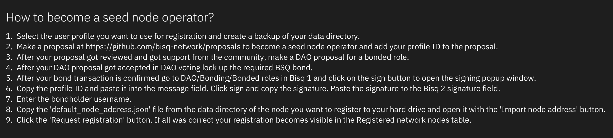
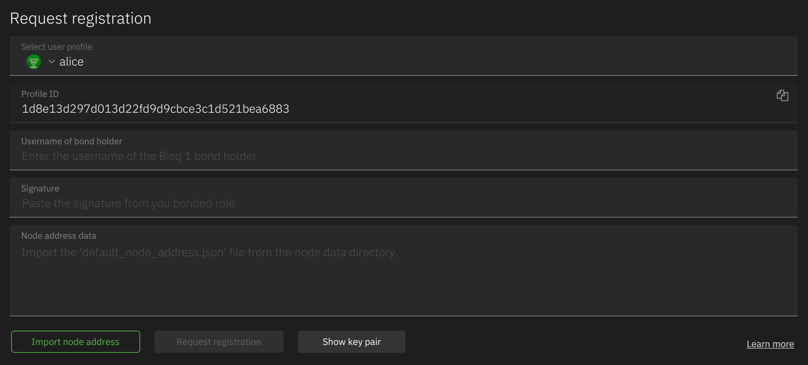

# How to operate a Bisq 2 seed node

## Requirements:

- Install the seed node on a VPS with min. 4 GB RAM and min 2 vCPUs.
- A seed node operator need to make a DAO proposal for a bonded role (seed node). After acceptance by DAO voting they
  need to lock up the BSQ bond (10 000 BSQ)
- After the bond is locked up, register your seed node in the Bisq2 `User Options/Nodes` screen. Follow the instructions
  in the UI.
- Currently, we only support Tor. Once I2P is supported all seed node operators need to run both networks.

For running a local seed node you do not need the above described process. You can find the technical details below how
to run a dev seed node.

## Install and run a Bisq 2 Seed node

- Checkout and build Bisq 2

```
git clone https://github.com/bisq-network/bisq2.git
cd bisq2
./gradlew build
```

- Stop gradle as it remains running in background and consumes allocated memory (e.g. `killall java`)

- Set up a systemd service

  - Create the `run_seed.sh` launch script:
  ```
  #!/bin/bash
  java -Xms2000M -Xmx3500M -jar [PATH TO bisq2]/seed_node_app/build/libs/seed_node_app-2.0.0-all.jar
  ```

  - Set correct permissions: `sudo chmod +x /root/run_seed.sh`

  - Add service `/etc/systemd/system/seed.service`:
  ```
  [Unit]
  Description=seed
  
  [Service]
  ExecStart=/root/run_seed.sh
  Restart=on-failure
  
  [Install]
  WantedBy=multi-user.target
  ```

  - Start/Restart/Stop the service:
  ```
  systemctl start seed.service
  systemctl restart seed.service
  systemctl stop seed.service
  ```

  - Check the logs: `journalctl --unit seed -n 100 --no-pager` \
    Or:
    `tail -100 [USER]/.local/share/Bisq2_seed_node/bisq.log`

For running a localhost dev seed node use following JVM arguments:
```
  -Dapplication.appName=bisq2_localhost_seed
  -Dapplication.network.configByTransportType.clear.defaultNodePort=8000 
  -Dapplication.network.supportedTransportTypes.0=CLEAR
```

## Register as seed node operator

Follow the instructions in the `User options/Nodes/Seed Node` screen:



After the seed node has been started up once it writes a json file to the data directory which contains the node address
data. Copy that and paste it into the input field.



After the data has been sent to the oracle node(s) those oracle node(s) verify the data using the Bisq DaoNode REST API
and if the data was valid they publish the new seed node operator data to the Bisq2 network.


> _Note: The user profile data gets published to the network but has a TTL of only about 2 weeks. Thus, the user profile
used as seed node operator should be republished before the TTL expire, otherwise the operators username in the table
shows `N/A` and the profile ID is not available (which is required for verification). Seed node operators are expected
to run their application with the user profile used for registration before the profile gets removed from the network._

After a node has been published to the network it appears in the network nodes table. Anyone can verify the operator by
following the instructions below the table:


## Root seed nodes

As at least one seed node is required for bootstrapping to the network (and receive registered seed node data), we need
to use hard coded public keys to allow those nodes to be used even there is no registration data available.

There will be only a minimum number of those nodes (2 seed nodes) and we refer to them as `root nodes`.

For those who operate such a `root node` there are a few extra steps:

1. Select the user profile you want to use for the registration.
2. Click the `Show key pair` button below the input fields. This will add 2 fields, one for the public and one for the
   private key which has been created for that user profile.
3. Copy the public key. Open `bisq.bonded_roles.AuthorizedPubKeys` class and add your pub key to the list of authorized
   keys and make a GitHub pull request.
4. Currently, the pub key is only used for oracle nodes not for seed nodes, but that might change in the future.
5. After you have started the seed node copy the onion address (and/or I2P) and add it to the Bisq 2 config files. There
   are several config files for the different applications (desktop, seed, oracle, rest api). Add your network address
   to the `application.network.seedAddressByTransportType` entry and make a GitHub pull request.

> _Note: Seed nodes which are not included in the config are not used by first time users. Those seed nodes get
distributed by the oracle node and only after the first start the users will receive those. Therefor root nodes have
higher availability requirements than other seed nodes.<br><br>
> Root nodes are expected to follow the same process as other nodes (DAO bond, registration) even this is not enforced
by the system._
