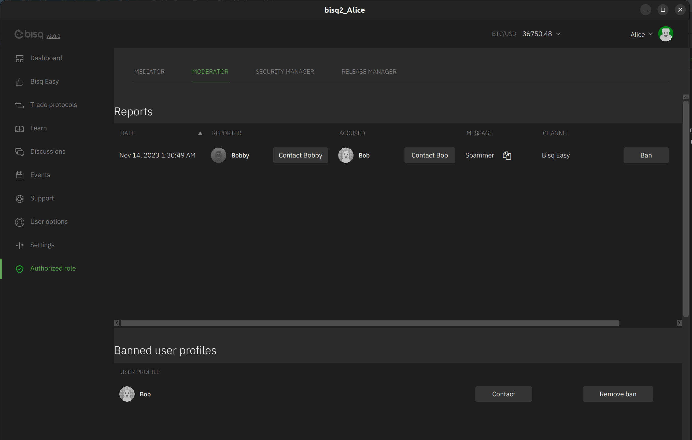

# Moderator

Users can report mis-behaving users to a moderator. The moderator receive the message and can contact both the reporting
user and the accused user to figure out if the report was justified. In case of severe violations the moderator can ban
a user.
In case of scams or severe trade violations the mediator can provide evidence to the moderator who decides if it is
justified to ban a user.

After successful registration the moderator will see the Authorized role menu item and the moderator screen visible.

