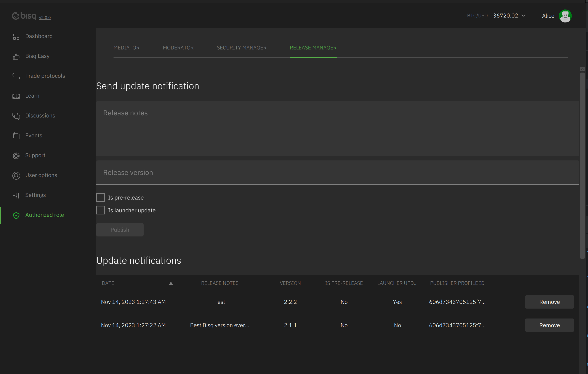
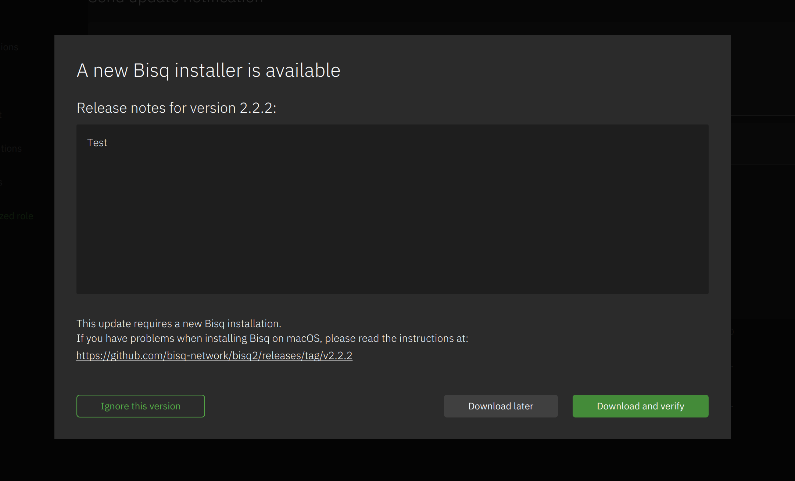

# Release manager

The release manager can send a `ReleaseNotification` to the network which contains:

- isPreRelease
- isLauncherUpdate
- ReleaseNotes
- Version

After successful registration the mediator will see the `Authorized role` menu item and the `Release manager` tab.

