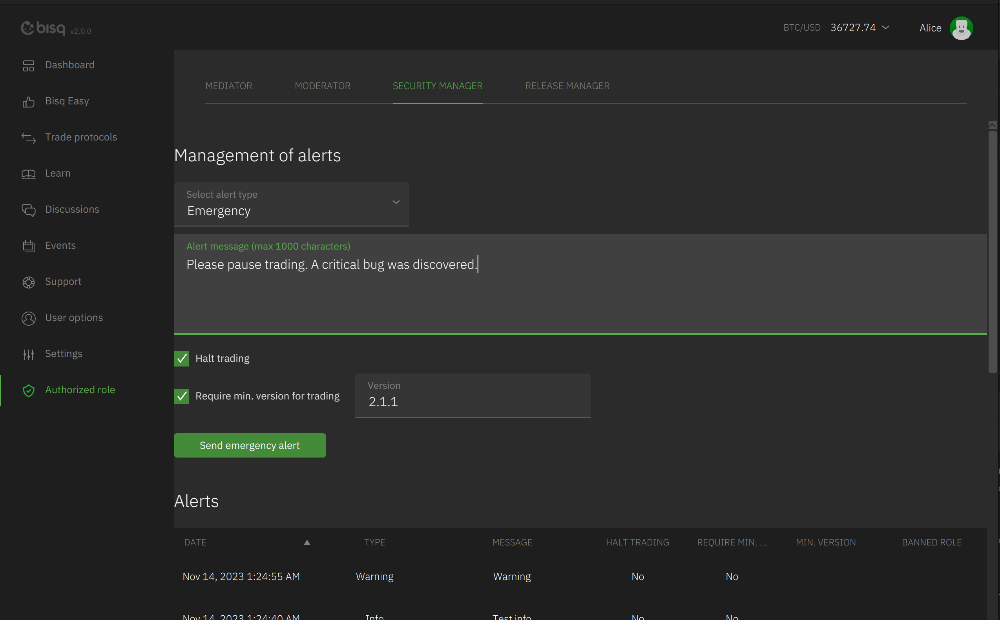
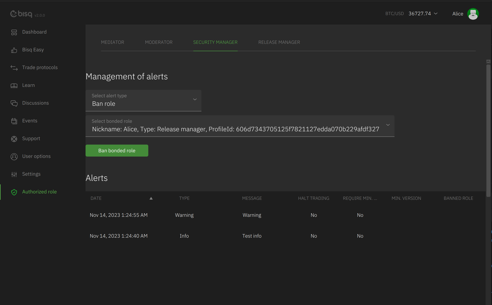

# Security manager

The security manager can send an `AuthorizedAlertData` to the network which contains:

- AlertType
- Optional message
- haltTrading
- requireVersionForTrading
- Optional minVersion,
- Optional bannedRole

AlertTypes:
- INFO: Informational message
- WARN: Warning message
- EMERGENCY: Emergency message with options to halt trading or require an update to a min version for trading
- BAN: Ban an `AuthorizedBondedRole` (e.g. other role or node)

User can ignore data from the security manager by adding the JVM argument:
`-Dapplication.bondedRoles.ignoreSecurityManager=true`

After successful registration the mediator will see the `Authorized role` menu item and the `Security manager` tab.

