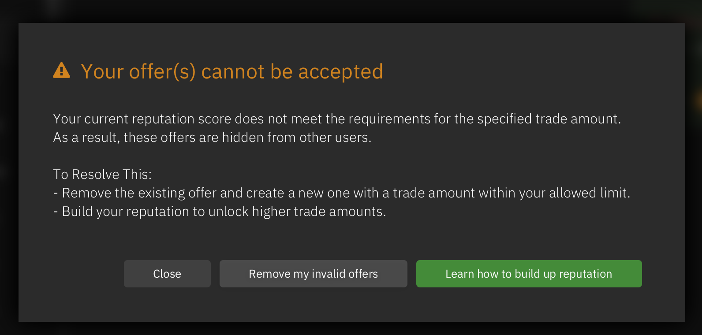
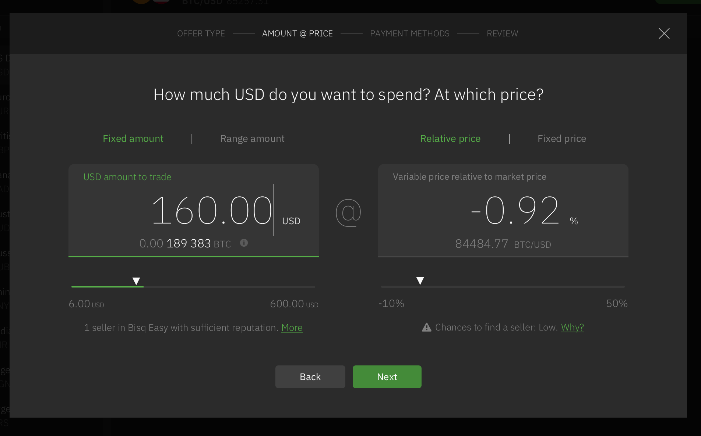
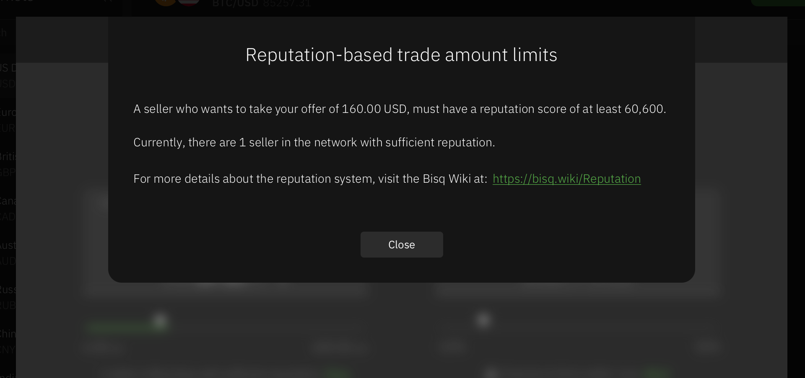
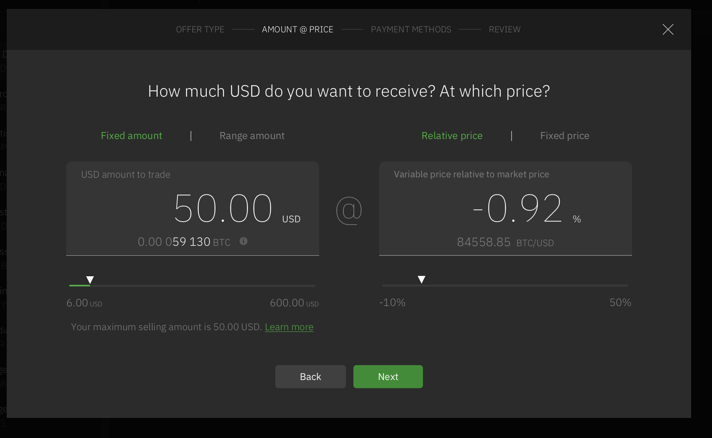
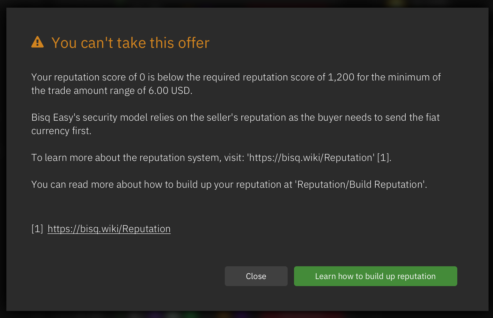
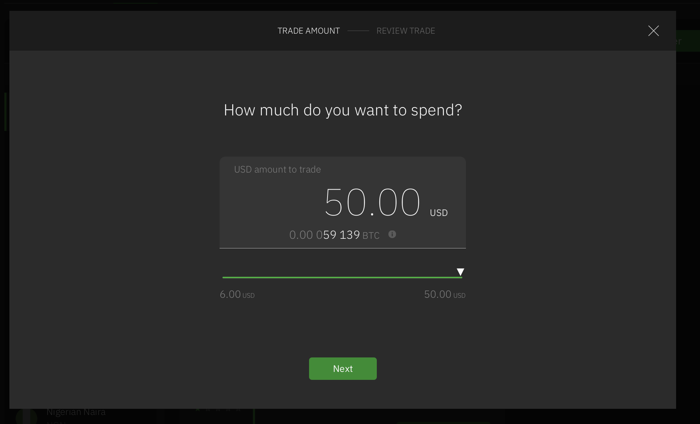
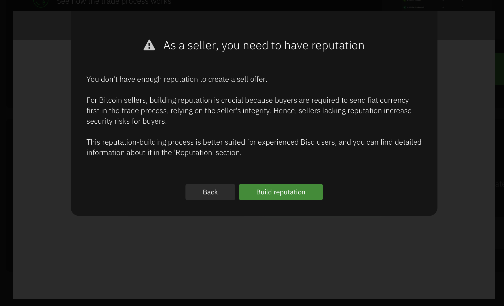
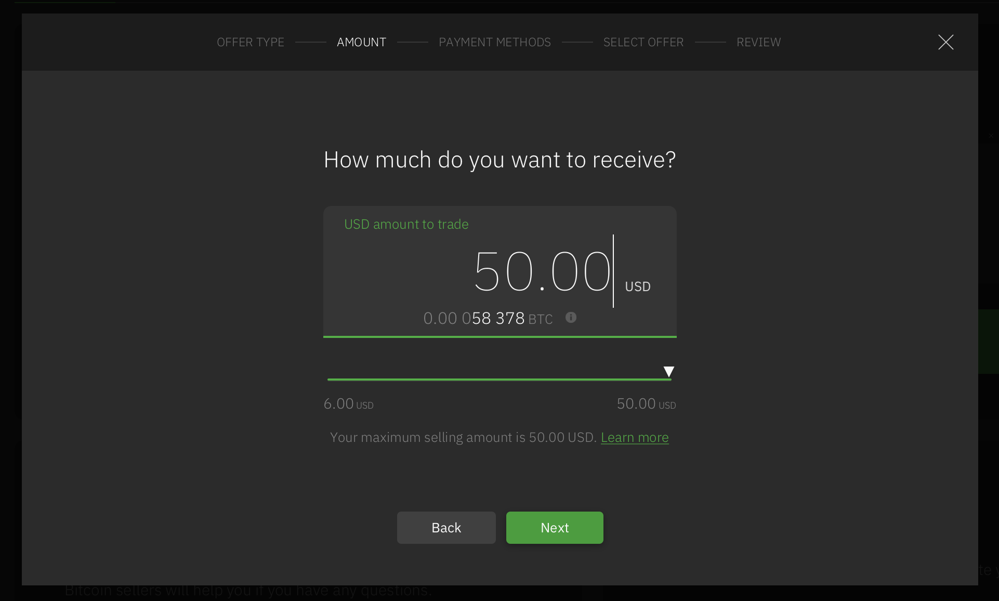

# Reputation based trade amount limits

We added a trade amount restriction for sellers based on the sellers reputation score as more flexible security protection.

The basic formula is:

`Max allowed trade amount for a seller = Sellers reputation score / 200`

Here is an overview of all use cases where this is applied to:

## My offers

At app startup we check if the user has sell offers which have a trade amount larger than their allowed reputation based amount. 
If so, we show a popup to remove those offers.

## Offerbook

The offerbook is filtered to only include valid offers where the sellers (maker) reputation matches the trade amount.

## Create offer

### Create BUY offer

Show text with number of sellers who have sufficient reputation for the selected amount.
Additionally, we show a green progress bar at the slider marking the range where potential sellers exist.

With click on `More` we open an overlay which gives context info:

### Create SELL offer

Show text with max amount. Learn more opens popup with text about score and amount

With click on `Learn more` we open an overlay which gives context info:

## Take offer

### Take fixed amount BUY offer (taker is seller)

We check if the taker has enough reputation to take that offer.
If not, we show that popup:

### Take range amount BUY offer (taker is seller)

We check if the taker has enough reputation for the min. amount of take that offer.
If so, we display the range capped by the takers max. allowed amount.
E.g. If offer has a range of 6-600 USD and taker has reputation scopre of 10000 the range is 6-50 USD (50 USD is max allowed amount for that taker).

### Take fixed amount SELL offer (taker is buyer)

We only show valid offers. No extra handling.

### Take range amount SELL offer (taker is buyer)

We only show valid offers. No extra handling.

## Trade Wizard (at getting started)

### User wants to buy BTC

We show the available sell offers filtered by the users entered amount.

### User wants to sell BTC

If the user has no reputation or below 1200 (required for min. amount of 6 USD), we show a popup how to build reputation.

If the user has a reputation score of at least 1200, we set the max. amount to their max. allowed amount. 
E.g. Is the user has a reputation scopre of 10000 the range is 6-50 USD (50 USD is max allowed amount for that taker)  

## Other areas

## Market channels

In the market list we filter to show number of offers per market filtered by valid reputation based offer amounts.
See `MarketChannelItem` check for `hasSellerSufficientReputation`

## Dashboard

In the Dashboard we filter to show number of all offers filtered by valid reputation based offer amounts.
See `DashboardController` check for `hasSellerSufficientReputation`

## Profile card

In the offers tab at the profile card we filter to show offers filtered by valid reputation based offer amounts.
See `ProfileCardOffersController` check for `hasSellerSufficientReputation`

