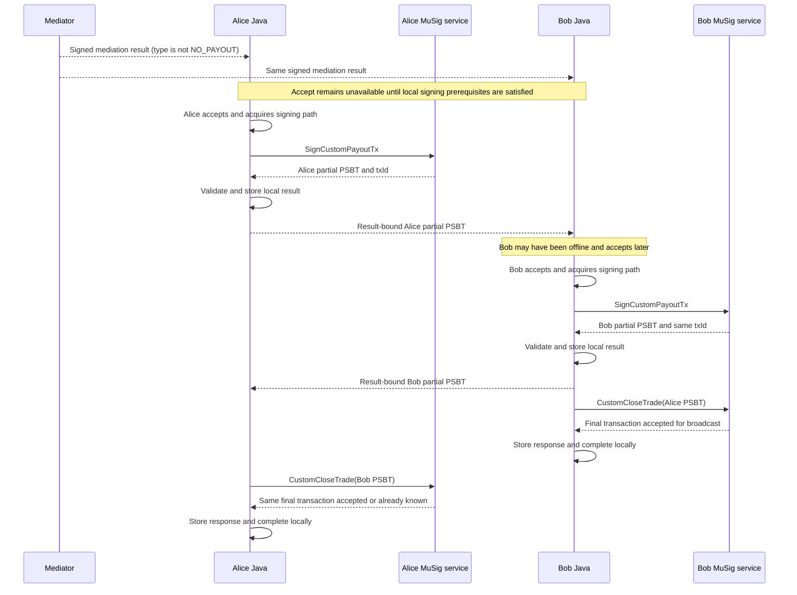

# Mediated custom payout settlement for MuSig trades

## Status

This document specifies the proposed first-version behavior for closing a mediated MuSig trade with a cooperative custom
payout. It is the target contract for [issue #4888](https://github.com/bisq-network/bisq2/issues/4888), not a description
of the current Java implementation.

The `SignCustomPayoutTx` and `CustomCloseTrade` RPCs are already available. The complete Java integration and parts of
the required service-side interface behavior, including broadcast, are not yet implemented. Requirements that need
further joint design are listed under [Deferred decisions](#deferred-decisions).

## Scope

This specification covers the flow after a mediator has produced a signed mediation result whose payout distribution
type is not `NO_PAYOUT`, including:

* prerequisites for calling `SignCustomPayoutTx`
* prerequisites for calling `CustomCloseTrade`
* P2P communication between the traders
* custom payout progress and persistence
* first-version retry, failure, and recovery behavior

It does not cover:

* mediator case investigation or payout calculation
* arbitration or non-cooperative recovery
* UI design

## Settlement model

The mediator authenticates a proposed payout split but does not sign a Bitcoin transaction. The custom payout remains
cooperative: both traders must accept the same signed result and sign the same transaction before it can be finalized.

The transaction spends both payout outputs of the fully signed DepositTx. Each output has a Taproot script-path policy
that requires one buyer signature and one seller signature. Each trader therefore creates a PSBT that partially signs
both inputs. Combining the two PSBTs supplies the two required signatures for each input.

The signatures commit to the complete unsigned transaction. A signature cannot be reused with a different payout,
fee, destination, or input set. Independently created PSBTs for the same transaction have the same transaction ID even
though their serialized PSBT bytes differ because they contain different signatures.

### Normal-flow message names

This specification refers to three existing messages from the normal cooperative close flow:

* message E is `PaymentInitiatedMessage_E`, sent from the buyer after initiating the fiat payment
* message F is `PaymentReceivedMessage_F`, sent from the seller after confirming receipt of the fiat payment
* message G is `CooperativeClosureMessage_G`, sent from the buyer while completing normal cooperative closure

## Eligibility and signing window

### Opening mediation

Mediation may be opened once the fully signed DepositTx exists and is known locally. A prepared or partially signed
deposit PSBT is insufficient. DepositTx confirmation is not required merely to open mediation.

A mediation result may be received and displayed before custom payout signing becomes available. The result does not
prove DepositTx confirmation and must not be used as a substitute for normal transaction observation.

### Results eligible for custom payout

The stored mediation result must be immutable, signed by the contract mediator, valid for the trade contract, and
allocate the full trade pot between buyer and seller.

The result and its mediator signature are write-once for the lifetime of the trade. Reopening mediation changes the
dispute state but does not permit replacing either value.

`NO_PAYOUT` is a valid mediator outcome, but it is not a cooperative custom payout proposal. For `NO_PAYOUT`, the client:

* offers neither `Accept` nor `Reject` for this flow
* records no trader custom payout decision
* creates and sends no partial PSBT
* calls neither custom payout RPC

### DepositTx confirmation prerequisite

Custom payout signing requires the normal validated transition for the exact fully signed DepositTx to
`MuSigTradeState.DEPOSIT_TX_CONFIRMED`. The current protocol threshold is one blockchain confirmation. Later eligible
normal states inherit this fact; custom payout data must not duplicate a separate confirmation flag.

The local `Accept` action is unavailable until this and all other stable signing prerequisites are satisfied. The client
must not intentionally persist an accepted-but-waiting decision for an already known missing prerequisite.

### Java signing-state allowlist

Immediately before calling `SignCustomPayoutTx`, the local `MuSigTradeState` must be exactly one of:

* `DEPOSIT_TX_CONFIRMED`
* `BUYER_INITIATED_PAYMENT`
* `SELLER_RECEIVED_INITIATED_PAYMENT_MESSAGE`

The signing window therefore remains open before and after normal-flow message E, but closes at the local message F
boundary:

| Normal-flow point | May custom signing start? |
|---|---|
| Before the fully signed DepositTx is known locally | No |
| DepositTx known but not confirmed | No |
| `DEPOSIT_TX_CONFIRMED`, before message E | Yes |
| After message E and before message F | Yes |
| Seller starts the action that creates message F | No |
| Buyer starts processing message F | No |
| Message G or any final state | No |

This allowlist is an application-state guard. It does not prove that the DepositTx payout outputs remain unspent.

### Serialization with normal closure

Starting `SignCustomPayoutTx` and crossing the local message F boundary must be serialized per trade.

* If message F starts first, custom payout signing must not start and the normal cooperative flow continues.
* If custom signing starts first, normal F processing waits for the signing outcome and must not invoke an incompatible
  normal-close RPC.

After custom signing succeeds, messages E, F, and G may still be authenticated and retained as payment-status information,
but they must not cause Java to invoke the normal cooperative-close RPCs.

## Trader decisions

### Acceptance

When `Accept` is available and selected, Java revalidates the prerequisites, atomically acquires the local signing path
against rejection and message F, and immediately calls `SignCustomPayoutTx`.

Acceptance has no independent persisted Boolean and no separate positive-acceptance P2P message. A successfully stored
local partial PSBT is the local positive artifact; the result-bound peer PSBT message is the positive artifact observed
by the other trader.

The trader does not wait for the peer to accept or come online before producing and sending a partial PSBT. Receiving a
peer PSBT also does not authorize local signing: the local trader must make their own decision and satisfy the local
signing gate.

### Rejection

A trader may reject a result whose payout distribution type is not `NO_PAYOUT` only before the local signing path has
been granted. Rejection is one-way, is bound to the exact result through its hash, creates no signature, and prevents a
later local custom payout signature.

If a peer has already supplied a contextually valid PSBT, a later peer rejection cannot revoke that released signature.
If a peer rejection was stored first, a later PSBT from that peer conflicts with the stored decision and cannot be used.

For each peer and mediation result, the first contextually valid decision artifact stored by Java wins:

* an exact repeat is idempotent
* rejection followed by a PSBT keeps the rejection
* a PSBT followed by rejection keeps the PSBT
* conflicting data never replaces the first stored artifact

This Java rule resolves application-level ordering only. A successful `CustomCloseTrade` response is still required
before Java treats both PSBTs as a completed custom payout.

## First-version end-to-end flow

Alice and Bob below identify the first and second trader to accept; either may be buyer or seller.



Each client sends its locally created partial PSBT. This lets both clients independently finalize when they are online;
the traders do not have to be online at the same time.

## Payout and fee rules

The full trade pot is:

```text
totalPayoutAmount = tradeAmount
                  + buyerSecurityDeposit
                  + sellerSecurityDeposit
```

For a mediation result whose payout distribution type is not `NO_PAYOUT`:

```text
buyerGrossPayout + sellerGrossPayout = totalPayoutAmount
```

The mediation amounts are gross allocations before the custom payout mining fee. Both clients pass the exact mediator
`proposedSellerPayoutAmount` as `sellersPayoutAmountExcludingFee`; Java does not deduct a fee first. The request contains
no buyer gross payout field.

For the first Java integration, both clients use the current prepared-transaction default fee rate of `2,500 sat/kwu`
(`10 sat/vB`). This is a temporary implementation assumption, not the production fee-agreement contract.
If the clients use different fee rates, they construct different transactions and return different transaction IDs;
Java must reject the mismatch and leave the settlement stalled rather than attempt unsafe finalization.

Despite their current `IncludingFee` names, `buyersPayoutAmountIncludingFee` and
`sellersPayoutAmountIncludingFee` are the actual transaction output amounts after fee deduction. Java requires each
returned amount to be non-negative and no greater than the corresponding proposed payout amount. Java must not deduct
another fee.

Java does not reproduce service-side fee or script-specific dust calculations. If `SignCustomPayoutTx` returns an error,
Java stores no local PSBT and sends no peer PSBT message.

## PSBT exchange and finalization

After a successful `SignCustomPayoutTx` response, Java validates and stores the local result before sending the partial
PSBT in a dedicated confidential mailbox message. The message binds the signature to:

* the immutable mediation result through `mediationResultHash`
* the concrete unsigned transaction through the RPC-returned `txId`

A peer PSBT may arrive before the local trader decides. Java may retain it after contextual validation, but it must not
trigger local signing or finalization. Once a local PSBT exists, Java requires the peer's claimed transaction ID to match
the local transaction ID. The PSBT byte arrays are not compared because they contain different signatures.

Matching Java metadata is necessary but not sufficient. Java treats the peer PSBT as usable for completion only after
`CustomCloseTrade` succeeds.

Java calls `CustomCloseTrade` only when both the local and peer result-bound partial PSBTs are available. Each client
makes this call independently.

## Completion boundary

The interface defines finalization and broadcast as one `CustomCloseTrade` operation. A successful response means the
Bitcoin backend accepted the exact finalized transaction for broadcast or reported that the identical transaction was
already known. It does not mean that the transaction is confirmed.

For the first version, a successful response is the local terminal event. Java stores the returned final transaction and
uses the existing role-specific terminal state:

* buyer: `BUYER_CLOSED_TRADE`
* seller: `SELLER_CLOSED_TRADE`

There is no custom-payout-specific terminal `MuSigTradeState`, and completion does not wait for mempool observation or a
blockchain confirmation. Completed-trade presentation uses the custom payout transaction ID, not the DepositTx ID.

No final-transaction P2P notification is required in the first version because each trader receives a successful local
`CustomCloseTrade` response.

## First-version failure behavior

The initial integration follows the existing one-shot MuSig RPC handling pattern:

* each custom payout RPC is called at most once
* no separate persisted requested-or-unknown state is introduced
* no automatic RPC retry or restart reconciliation is attempted
* successful responses and validated peer artifacts use the normal trade persistence flow

Once `SignCustomPayoutTx` is dispatched, an error or missing response cannot prove that the service did not sign. Java
therefore sends no PSBT without a successful response, but it also must not resume normal cooperative closure, choose a
different settlement, or retry blindly. The first-version flow fails or stalls conservatively.

After a local PSBT is created and sent, an offline or unresponsive peer leaves settlement pending without an automatic
timeout. A valid peer rejection received before a peer PSBT leaves settlement blocked. Neither condition automatically
changes the payout, creates another signature, resumes normal cooperative closure, starts forced closure, or enters
arbitration.

A `CustomCloseTrade` error likewise does not authorize a blind retry, a different settlement, or normal cooperative
closure. These limitations make the first iteration suitable for implementing and testing the happy path, but not the
complete production recovery contract.

## Security requirements

* Do not request a wallet signature before all business and local-state prerequisites are satisfied.
* Use only the payout addresses fixed during trade setup; a mediation message must not introduce payout addresses.
* Bind every peer artifact to the exact immutable mediation result.
* Treat result hashes and claimed transaction IDs as untrusted metadata until the applicable validation succeeds.
* Apply a named maximum size before accepting or parsing a peer PSBT.
* Do not log raw PSBTs, signatures, derivation metadata, or transaction bytes at normal log levels.
* Treat the local gRPC endpoint as security-sensitive; localhost binding alone is not authorization.
* Never silently change payout amounts, fee rate, destinations, or transaction inputs after a signature may have been
  produced.

## Deferred decisions

The following are intentionally outside the first happy-path contract and require joint interface agreement before the
corresponding production behavior is implemented:

* the production fee source and how both clients agree on the same value
* authoritative live checking that the expected DepositTx outputs remain unspent
* RPC idempotency and reconciliation after an error or process restart, using the unchanged RPC schemas
* durable service-side trade, PSBT, final-transaction, and broadcast state
* structured RPC errors and ambiguous-outcome handling
* durable handling of a peer message received before all validation context exists
* safe role-specific recovery after a trader has released a custom payout signature, including the current seller-side
  recovery gap
* chain observation, conflicting-spend detection, transaction eviction, and reorganization handling
