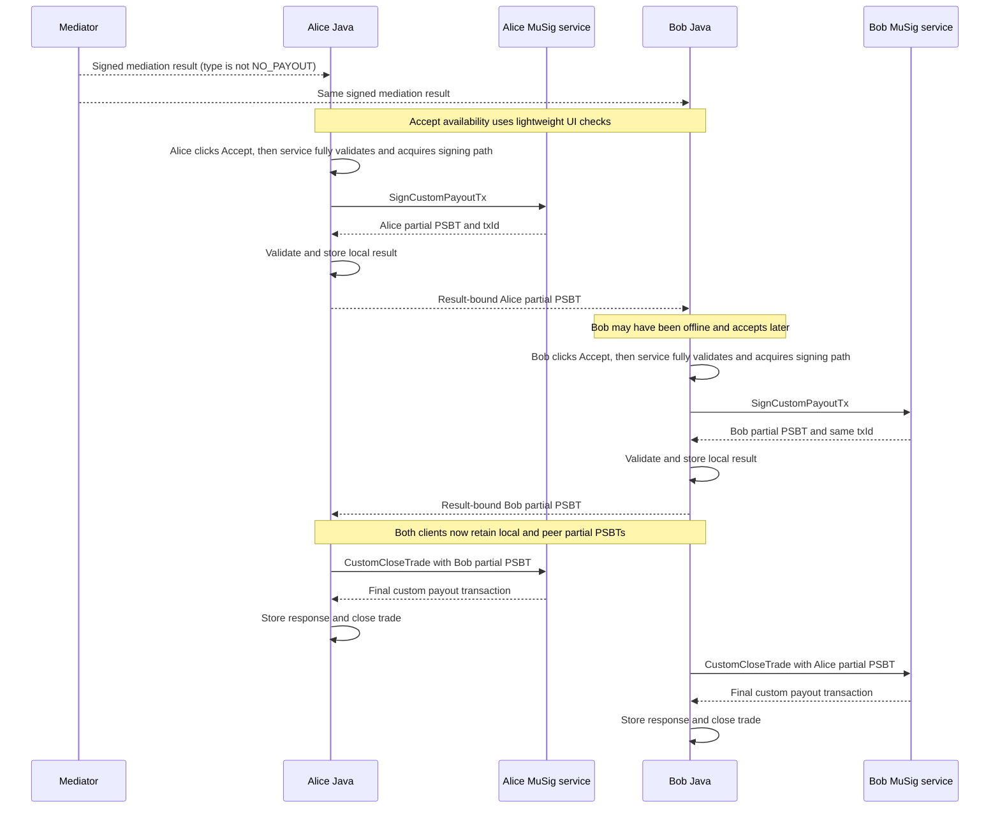

# Mediated custom payout settlement for MuSig trades

## Status

This document describes the current first-version Java behavior for a mediated MuSig custom payout and separates it from
the completion behavior that remains to be implemented for
[issue #4888](https://github.com/bisq-network/bisq2/issues/4888).

The current Java implementation validates acceptance eligibility, calls `SignCustomPayoutTx`, persists the local partial
PSBT, exchanges result-bound PSBT and rejection messages, and enters `CUSTOM_PAYOUT_SIGNED`. It can also persist a peer
PSBT received before or after local acceptance. Once both PSBTs are available with matching claimed transaction IDs, it
automatically invokes the guarded `CustomCloseTrade` handler and transitions to `CUSTOM_PAYOUT_CLOSED_TRADE` after a
successful response. Service-side broadcast remains a placeholder.

One response validation is temporarily disabled because existing trade setup sends fixed security-deposit amounts to
the MuSig service. This known prerequisite is described under [Payout and fee rules](#payout-and-fee-rules).

## Scope

This specification covers the flow after a mediator has produced a signed mediation result whose payout distribution
type is not `NO_PAYOUT`, including:

* prerequisites for calling `SignCustomPayoutTx`
* prerequisites for calling `CustomCloseTrade`
* P2P communication between the traders
* custom payout progress and persistence
* first-version retry, failure, and recovery behavior

It does not cover:

* mediator case investigation or payout calculation
* arbitration or non-cooperative recovery
* UI design

## Settlement model

The mediator authenticates a proposed payout split but does not sign a Bitcoin transaction. The custom payout remains
cooperative: both traders must accept the same signed result and sign the same transaction before it can be finalized.

The transaction spends both payout outputs of the fully signed DepositTx. Each output has a Taproot script-path policy
that requires one buyer signature and one seller signature. Each trader therefore creates a PSBT that partially signs
both inputs. Combining the two PSBTs supplies the two required signatures for each input.

The signatures commit to the complete unsigned transaction. A signature cannot be reused with a different payout,
fee, destination, or input set. Independently created PSBTs for the same transaction have the same transaction ID even
though their serialized PSBT bytes differ because they contain different signatures.

### Normal-flow message names

This specification refers to three existing messages from the normal cooperative close flow:

* message E is `PaymentInitiatedMessage_E`, sent from the buyer after initiating the fiat payment
* message F is `PaymentReceivedMessage_F`, sent from the seller after confirming receipt of the fiat payment
* message G is `CooperativeClosureMessage_G`, sent from the buyer while completing normal cooperative closure

## Eligibility and signing window

### Opening mediation

The current trader service checks that the contract has a mediator, the trade channel exists, and the dispute state is
`NO_DISPUTE`. The desktop currently exposes the mediation action for every non-final trade state. It therefore does not
yet enforce the intended prerequisite that the fully signed DepositTx exists and is known locally. DepositTx confirmation
is not required merely to open mediation.

A mediation result may be received and displayed before custom payout signing becomes available. The result does not
prove DepositTx confirmation and must not be used as a substitute for normal transaction observation.

### Results eligible for custom payout

The stored mediation result must be immutable, signed by the contract mediator, valid for the trade contract, and
allocate the full trade pot between buyer and seller.

The result and its mediator signature are write-once for the lifetime of the trade. Reopening mediation changes the
dispute state but does not permit replacing either value.

`NO_PAYOUT` is a valid mediator outcome, but it is not a cooperative custom payout proposal. For `NO_PAYOUT`, the client:

* offers neither `Accept` nor `Reject` for this flow
* records no trader custom payout decision
* creates and sends no partial PSBT
* calls neither custom payout RPC

### DepositTx confirmation prerequisite

Custom payout signing requires the normal transition for the DepositTx to
`MuSigTradeState.DEPOSIT_TX_CONFIRMED`. The implemented confirmation-status callback would create that event when it
reports more than zero confirmations, but `observeDepositTxConfirmationStatus` currently returns before subscribing.
The development skip action is therefore the current way to enter this state. Later eligible normal states inherit the
state transition; custom payout data does not duplicate a separate confirmation flag.

The desktop enables `Accept` using lightweight checks on UI-owned state, including the deposit-confirmed signing window.
An enabled button does not guarantee acceptance: the service performs full signing validation after the click and before
`SignCustomPayoutTx`. Missing prerequisites must not result in a persisted accepted-but-waiting decision.

### Java signing-state allowlist

Immediately before calling `SignCustomPayoutTx`, the local `MuSigTradeState` must be exactly one of:

* `DEPOSIT_TX_CONFIRMED`
* `BUYER_INITIATED_PAYMENT`
* `SELLER_RECEIVED_INITIATED_PAYMENT_MESSAGE`

The signing window therefore remains open before and after normal-flow message E, but closes at the local message F
boundary:

| Normal-flow point | May custom signing start? |
|---|---|
| Before the fully signed DepositTx is known locally | No |
| DepositTx known but not confirmed | No |
| `DEPOSIT_TX_CONFIRMED`, before message E | Yes |
| After message E and before message F | Yes |
| Seller starts the action that creates message F | No |
| Buyer starts processing message F | No |
| Message G or any final state | No |

This allowlist is an application-state guard. It does not prove that the DepositTx payout outputs remain unspent.

### Serialization with normal closure

Starting `SignCustomPayoutTx` and crossing the local message F boundary are serialized on the same trade protocol
monitor. Acceptance, rejection, dispute updates, and custom finalization use that monitor too.

* If message F starts first, custom payout signing must not start and the normal cooperative flow continues.
* If custom signing starts first, normal F processing waits for the signing outcome and must not invoke an incompatible
  normal-close RPC.

After custom signing succeeds, normal closure must not invoke an incompatible RPC. The current buyer protocol
context-checks and consumes a late message F without applying its normal close behavior. The seller protocol consumes a
local payment-receipt confirmation without changing state. No message G completion path is configured from
`CUSTOM_PAYOUT_SIGNED`.

## Trader decisions

### Acceptance

When `Accept` is available and selected, Java queues the action on the MuSig trade executor. The service rechecks the
prerequisites under the trade protocol monitor and submits a `MediationResultAcceptedEvent`. The synchronized FSM orders
that event against rejection and message F; if its transition
is selected, the handler immediately calls `SignCustomPayoutTx`.

Acceptance has no independent persisted Boolean and no separate positive-acceptance P2P message. A successfully stored
local partial PSBT is the local positive artifact; the result-bound peer PSBT message is the positive artifact observed
by the other trader.

The trader does not wait for the peer to accept or come online before producing and sending a partial PSBT. Receiving a
peer PSBT also does not authorize local signing: the local trader must make their own decision and satisfy the local
signing gate.

### Rejection

A trader may reject a result whose payout distribution type is not `NO_PAYOUT` only before the local signing path has
been granted. Rejection is one-way, is bound to the exact result through its hash, creates no signature, and prevents a
later local custom payout signature.

If a peer has already supplied a contextually valid PSBT, a later peer rejection cannot revoke that released signature.
If a peer rejection was stored first, a later PSBT from that peer conflicts with the stored decision and cannot be used.

For messages that can be processed immediately, the first contextually valid decision artifact stored for the peer wins:

* an exact repeat is idempotent
* rejection followed by a PSBT keeps the rejection
* a PSBT followed by rejection keeps the PSBT
* conflicting data never replaces the first stored artifact

If both message types were held in the live-process settlement queue because their validation context was missing,
rejection is deliberately replayed before the PSBT regardless of arrival order.

This Java rule resolves application-level ordering only. A successful `CustomCloseTrade` response is still required
before Java treats both PSBTs as a completed custom payout.

## Current end-to-end flow

Alice and Bob below identify the first and second trader to accept; either may be buyer or seller.



Each client sends its locally created partial PSBT through a confidential mailbox message, so the traders do not have to
be online at the same time. Each client independently finalizes after it has both matching partial PSBTs.

## Payout and fee rules

The full trade pot is:

```text
totalPayoutAmount = tradeAmount
                  + buyerSecurityDeposit
                  + sellerSecurityDeposit
```

For a mediation result whose payout distribution type is not `NO_PAYOUT`:

```text
buyerGrossPayout + sellerGrossPayout = totalPayoutAmount
```

The mediation amounts are gross allocations before the custom payout mining fee. Both clients pass the exact mediator
`proposedSellerPayoutAmount` as `sellersPayoutAmountExcludingFee`; Java does not deduct a fee first. The request contains
no buyer gross payout field.

The handler passes `MuSigFeeRateProvider.getPreparedTxFeeRate()`. Its current default is `2,500 sat/kwu` (`10 sat/vB`).
This is a temporary implementation assumption, not the production fee-agreement contract.
If the clients use different fee rates, they construct different transactions and return different transaction IDs.
An incoming peer PSBT is rejected when a different local `txId` already exists. If the peer PSBT was stored first, a
different local signing response is stored and sent after logging the mismatch. The mismatch does not establish which
transaction is correct, but it must prevent finalization.

Despite their current `IncludingFee` names, `buyersPayoutAmountIncludingFee` and
`sellersPayoutAmountIncludingFee` are the actual transaction output amounts after fee deduction. Java currently requires
both values to be non-negative, validates the PSBT and transaction ID, and does not deduct another fee.

The checks that each returned amount is no greater than its corresponding proposed payout are temporarily disabled.
Existing `NonceSharesRequest` construction passes fixed 30,000-sat buyer and seller security deposits to the MuSig
service, while the mediator derives the payout pool from the contract's collateral percentages. Except where those
amounts happen to coincide, the service transaction and mediation result use different payout pools. Trade setup must be
fixed to use the contract amounts and the upper-bound checks must be restored before finalization is safe for production.

Java does not reproduce service-side fee or script-specific dust calculations. If `SignCustomPayoutTx` returns an error,
Java stores no local PSBT and sends no peer PSBT message.

## PSBT exchange and current stopping point

After a successful `SignCustomPayoutTx` response, Java validates and stores the local result before sending the partial
PSBT in a dedicated confidential mailbox message. The message binds the signature to:

* the immutable mediation result through `mediationResultHash`
* the concrete unsigned transaction through the RPC-returned `txId`

A peer PSBT may arrive before the local trader decides. Java may retain it after contextual validation, but it does not
trigger local signing. Once a local PSBT exists, Java requires a newly received peer transaction ID to match it. If the
peer value was stored first, a different local response is retained after logging a warning. The PSBT byte arrays are
not compared because they contain different signatures. When both claimed transaction IDs match, Java triggers
finalization.

The peer message is handled and persisted in the signing-window states and in `CUSTOM_PAYOUT_SIGNED`. A seller already in
`SELLER_CONFIRMED_PAYMENT_RECEIPT` consumes a late peer PSBT without storing it because normal closure has already been
selected locally.

Matching Java metadata is necessary but not sufficient for finalization. The peer-message handler validates and
persists the peer artifact but does not itself submit it to the MuSig service. After that handler returns, the settlement
readiness check emits the finalization event if both matching PSBTs are present.

The finalization handler calls `CustomCloseTrade` only when both the local and peer result-bound partial PSBTs are
available and their claimed transaction IDs match. Equality is only a Java pre-check; the MuSig service must still
validate the actual peer PSBT. Each client makes this call independently once its finalization prerequisites are satisfied.

## Completion boundary

The current Java state model contains a non-final `CUSTOM_PAYOUT_SIGNED` state and a final
`CUSTOM_PAYOUT_CLOSED_TRADE` state. Acceptance transitions into `CUSTOM_PAYOUT_SIGNED`. A configured finalization event
calls `CustomCloseTrade`, checks that the returned transaction is non-empty, stores its response in local party data,
and enters `CUSTOM_PAYOUT_CLOSED_TRADE`. Production code emits that event after either local signing or peer-PSBT
processing establishes readiness.

The interface contract defines finalization and broadcast as one `CustomCloseTrade` operation. A successful
response is intended to mean that the backend accepted the exact finalized transaction for broadcast or reported that
the identical transaction was already known; it does not mean confirmation. Service-side broadcast is currently a
placeholder. Java already persists the successful response and enters `CUSTOM_PAYOUT_CLOSED_TRADE` without waiting for
blockchain confirmation.

There is currently no final-transaction P2P notification.

## First-version failure behavior

The current integration follows the existing one-shot MuSig RPC handling pattern:

* each handled acceptance event makes one blocking `SignCustomPayoutTx` call
* no separate persisted requested-or-unknown state is introduced
* no automatic RPC retry or restart reconciliation is attempted
* successful responses and validated peer artifacts use the normal trade persistence flow

Once `SignCustomPayoutTx` is dispatched, an error or missing response cannot prove that the service did not sign. Java
therefore sends no PSBT without a successful response. A thrown handler exception follows normal FSM error handling and
moves the trade to `FAILED`. If the blocking RPC never returns, the handler remains blocked and the state does not
advance. There is no automatic retry or reconciliation in either case.

Because starting the RPC is not persisted, restarting before its response can permit another acceptance attempt. The
current flow has no way to reconcile that attempt with any service-side state created by the first call.

After a local PSBT is created and sent, an offline or unresponsive peer leaves the trade in `CUSTOM_PAYOUT_SIGNED` without
an automatic timeout. A valid peer rejection received after local signing also leaves it there. Before local signing, a
peer rejection prevents custom signing but does not stop the normal trade FSM from continuing. None of these conditions
automatically changes the payout, creates another signature, starts a recovery path, or enters arbitration.

A `CustomCloseTrade` error follows the normal FSM failure path, but there is no automatic retry or reconciliation after
an ambiguous outcome. These limitations make the current code suitable for testing the happy-path finalization handler,
but not production recovery.

## Security requirements

* Do not request a wallet signature before all business and local-state prerequisites are satisfied.
* Use only the payout addresses fixed during trade setup; a mediation message must not introduce payout addresses.
* Bind every peer artifact to the exact immutable mediation result.
* Treat result hashes and claimed transaction IDs as untrusted metadata until the applicable validation succeeds.
* Apply a named maximum size before accepting or parsing a peer PSBT.
* Do not log raw PSBTs, signatures, derivation metadata, or transaction bytes at normal log levels.
* Treat the local gRPC endpoint as security-sensitive; localhost binding alone is not authorization.
* Never silently change payout amounts, fee rate, destinations, or transaction inputs after a signature may have been
  produced.

The disabled payout upper-bound checks and fixed deposit inputs are a known violation of the intended validation
boundary. The current implementation must not be treated as safe for production transaction finalization until they are
corrected.

## Deferred decisions

The following are intentionally outside the first happy-path contract and require joint interface agreement before the
corresponding production behavior is implemented:

* the production fee source and how both clients agree on the same value
* deriving the service-side buyer and seller security deposits from the contract and restoring response amount checks
* enabling or replacing automatic DepositTx confirmation observation
* authoritative live checking that the expected DepositTx outputs remain unspent
* RPC idempotency and reconciliation after an error or process restart, using the unchanged RPC schemas
* durable service-side trade, PSBT, final-transaction, and broadcast state
* structured RPC errors and ambiguous-outcome handling
* durable handling of a peer message received before all validation context exists
* safe role-specific recovery after a trader has released a custom payout signature, including the current seller-side
  recovery gap
* chain observation, conflicting-spend detection, transaction eviction, and reorganization handling
